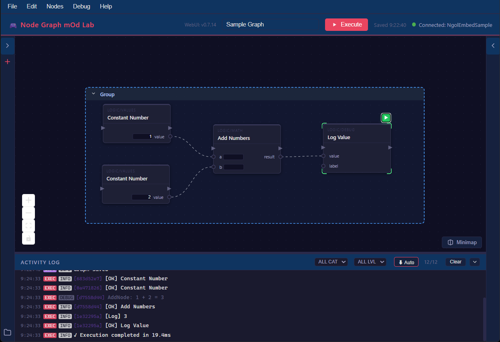
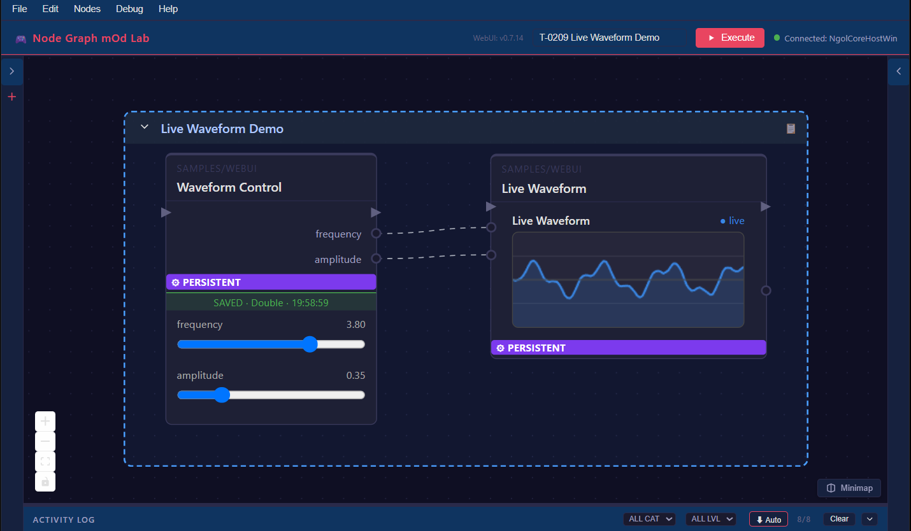
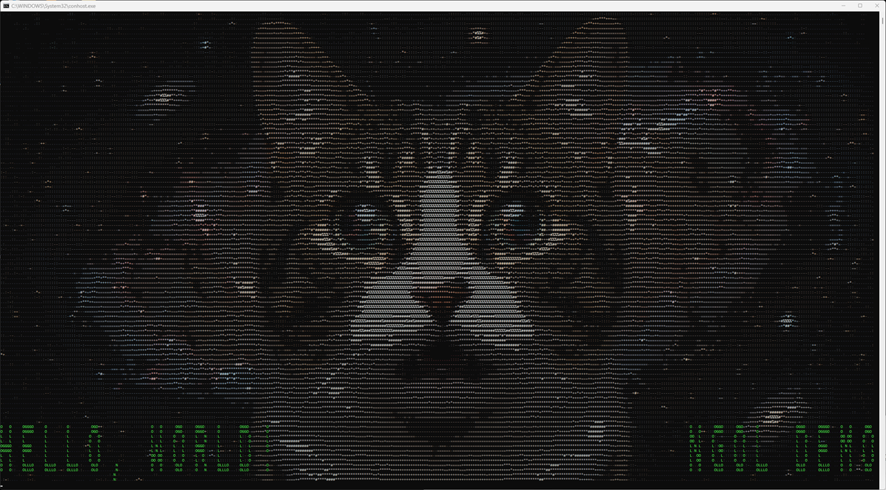

# NGOL (Node Graph mOd Lab)

**任意の .NET ホストアプリケーションに組み込める、ローカル動作のビジュアルノードグラフ実行環境**

> 既存ロジックの書き換えは不要。数行の初期化コードを追加するだけで、ブラウザ上のビジュアルノードグラフエディタと、AIエージェント向けのMCPにより、稼働中のホストプロセスの内部状態をリアルタイムに観察・操作できるようになります。新しく書いたノードはホットリロードでそのまま反映されるため、AIエージェントはアプリ再起動無しに必要な機能を書き足しながら、自律的かつ効率的に調査・実装を進められます。

[](LICENSE)

<br clear="left" />

> [!WARNING]
> 本プロジェクトは、AIコーディングツールによる生成をベースに構築された実験的リポジトリです。現在は挙動検証のためのベータ公開期間となります。そのため、予期せぬ不具合やエッジケースでの考慮漏れが含まれている可能性があります。実際にコードを利用・フォークされる際は、ご自身でも挙動を十分にご検証いただいた上で、自己責任にてお取り扱いください。

---

## 概要

**NGOL** は、.NET ホストアプリケーションに埋め込んで使う、ローカル動作のノードグラフ実行環境です。

- 組み込みノードを接続してホストアプリケーションの状態を操作したり、独自のカスタムノードを C# で記述してリアルタイムにコンパイル・実行できます
- ホスト側で HTTP + WebSocket サーバーを起動し、同じPC上のブラウザからグラフエディタ（WebUI）にアクセスできます
- Model Context Protocol（MCP）サーバーを通じて、Claude Code / Cursor / Github Copilot 等の AI エージェントがグラフの構築・実行・カスタムノード作成を自律的に行えます

ホストアプリケーションの既存ロジックを書き換える必要はありません。数行の初期化コードを追加するだけで組み込めます。ビルド済みの .NET 実行ファイルが対象なら、`DOTNET_STARTUP_HOOKS` によりコードの追加すら不要な注入方法もあります（具体的な手順は下記クイックスタート参照）。

---

## 機能一覧

### グラフ編集
- **ビジュアルノードエディタ** — ブラウザ上でドラッグ＆ドロップによるグラフ編集
- **組み込みノードライブラリ** — ロジック・数値演算・ForEach 等の汎用ノード
- **ノードパックDLL作成** — 複数選択ノードの .cs ソースをまとめて DLL にコンパイル
- **グラフの保存/読み込み** — JSON 形式で保存
- **コンテキストメニューノード検索** — キャンバス右クリック → "Add Node..." または `A` キーでノード検索
- **グラフ注釈（Annotation）・ノードグループ** — キャンバス上にメモを残しつつグラフを整理

### 断片グラフシステム（Fragment Graph）
- **複数の断片を1つのグラフに保持** — 連結成分を自動的に「断片」として識別し、断片ごとの個別実行・グラフ全体の一括実行のどちらも可能
- **断片間の結果引き継ぎ** — ある断片の実行結果を Snapshot ノードに保持しておき、別の断片の入力として使える

### Snapshot ノード・共有 KV ストア
- **Snapshot ノード** — Number / String / Bool / List / Any 等、断片間で値を橋渡しする
- **ノード間共有 KV ストア** — `IExecutionContext.SharedStore` によるノード間の値共有。LiteDB バックエンドでプロセス再起動をまたいで値を保持

### Persistent Nodes（永続実行ノード）
- **単発実行に留まらない継続動作** — `RegisterPersistent` で登録すると、1回の `Execute()` 呼び出しを超えて、ホストの更新ループに合わせたコールバックが継続的に呼ばれ続け、明示的に停止するまで動作し続けるノードを作れます

### カスタムノード開発
- **ホットリロード** — `Nodes/CustomNodes/cs/`（サブディレクトリ含む）の `.cs` ファイルを保存するだけでホストアプリケーション再起動なしに再コンパイル・ノード再登録
- **Roslyn ベースの動的コンパイル** — 単一C#ファイルのノードに加え、`.srclist` による複数ファイル構成にも対応。`.rsp`（csc.exe 互換のコンパイラレスポンスファイル）による追加アセンブリ参照

### WebUI 拡張プラグイン
- **`.js` ファイルの配置だけで 独自UI を追加** — WebUI を再ビルドせずに、ノードの見た目全体（`nodeRenderer`）・ノード内ウィジェット（`widget`）・独立パネル（`panel`）を追加できます
- **メニュー・コンテキストメニュー・キャンバスオーバーレイの拡張** — エディタ本体の挙動にも `.js` のみで介入できます
- **既存ノードの見た目を上書き** — 他開発者が配布した任意のノードに対しても、`registerNodeRendererOverride` で見た目を差し替えられます

<br clear="left" />

上のスクリーンショットは、周波数・振幅スライダー（widget プラグイン）の操作をリアルタイムに反映しながら Canvas に波形を描画する（nodeRenderer プラグイン）、2 ノード連携のライブデモです。サンプル: [`samples/WebUIPlugins/`](samples/WebUIPlugins/)。詳細ガイド: [docs/webui-plugin-guide.md](docs/webui-plugin-guide.md)

### AI エージェント連携（MCP サーバー）
- **MCP サーバー（`mcp/`）** — AI エージェントが NGOL を自律操作できる Model Context Protocol サーバー
- **ホットリロードとの組み合わせによる自律的な作業効率化** — 調査や作業の途中で必要なノードが足りなければ、AIエージェントが自分でC#コードを書いて MCP 経由でホットロードし、そのまま次の一手に使えます。あらかじめ全ての機能を人間が用意しておく必要がなく、道具を作りながら作業を進められます
- **ノード調査 / グラフ構築 / 断片実行 / 単体ノード実行等** — グラフ構築からカスタムノードのホットリロード保存まで一通りをツール経由で操作可能

---

## クイックスタート

### 1. NGOL ランタイム一式（`NGOL/`）の入手

以下いずれかの方法で NGOL ランタイム一式を用意します。

**方法A: GitHub Releases から入手**

[GitHub Releases](../../releases) からダウンロードした `NGOL-v{VERSION}.zip` を展開すると `NGOL/` フォルダが得られます。

**方法B: ソースからビルド**（.NET SDK + Node.js が必要）

```powershell
git clone <このリポジトリのURL>
cd NodeGraphModLab
.\scripts\create-core-release-package.ps1
```

`release\public\NGOL-v{VERSION}.zip` が生成されます。展開すると方法Aと同じ `NGOL/` フォルダが得られます。
内部では `NodeGraphModLab.Core.sln` の .NET ビルド → `WebUI`/`mcp` の npm ビルド → ステージング → zip 生成を一括で行います。
zip化前の展開済みフォルダ（`release/public/staging/NGOL/`）はビルド後もそのまま残るので、zipの展開作業を挟まずこちらを次項の `-SourceDir` に直接渡すこともできます。

### 2. .NET ホストアプリケーションへの組み込み

自作の .NET コンソールアプリから NGOL を組み込んで起動する最小サンプルを 2 種類用意しています。

| サンプル | 組み込み方式 |
|---|---|
| [`samples/NgolEmbedSample/`](samples/NgolEmbedSample/) | コンパイル時に NGOL の DLL を直接参照する、素直な組み込み方 |
| [`samples/NgolPluggableSample/`](samples/NgolPluggableSample/) | コンパイル時参照を持たず、reflection 経由で「あれば使う、無ければ使わない」任意の依存として組み込む方式 |

上記1で入手した `NGOL/` フォルダを各サンプルの `setup-*.ps1` スクリプトに渡すことでランタイム一式を組み立てられます。

```powershell
git clone <このリポジトリのURL>
cd NodeGraphModLab/samples/NgolEmbedSample
.\setup-ngol-embed-sample.ps1 -SourceDir "<入手したNGOL/フォルダのパス>"
dotnet run -- .\ngol-plugin
```

サンプルのセットアップ手順は上記の通りですが、実際にホストアプリケーションへ組み込むコードは以下の数行です（[`NgolActivator.cs`](samples/NgolEmbedSample/NgolActivator.cs)より抜粋）。

```csharp
// 1. NGOLのDLLをロード（ngolRoot は NGOL/ フォルダのパス）
Assembly.LoadFrom(Path.Combine(ngolRoot, "NodeGraphModLab.NodeAPI.dll"));
Assembly.LoadFrom(Path.Combine(ngolRoot, "NodeGraphModLab.Core.dll"));
Assembly.LoadFrom(Path.Combine(ngolRoot, "NodeGraphModLab.HostLogging.dll"));

// 2. NGOLを起動（WebUIサーバー・ノードレジストリ・ホットリロード監視がまとめて立ち上がる）
var logger = new ConsoleFileNgolLogger(Path.Combine(AppContext.BaseDirectory, "host.log"));
var options = new NgolRuntimeOptions { EnableDirectMode = true, PluginVersion = "MyApp", GameName = "MyApp" };
var runtime = new NgolRuntime(logger, options);
runtime.Initialize(ngolRoot);
```

`EnableDirectMode = true` は、フレーム駆動の Update コールバックを持たないホスト（コンソールアプリ等）向けに、NGOL内部で専用スレッドを立ててポーリングするモードです。フレーム駆動の Update を持つホスト（ゲームエンジン等）では `false` にします。

### 3. WebUI・MCP の起動確認

起動後、コンソールに表示される `WebUI: http://127.0.0.1:11156/` をブラウザで開くとグラフエディタにアクセスできます。

MCP サーバー（`mcp/`）を AI エージェントに接続する場合は、`mcp/mcp.json.example` を参考に設定してください。

> [!IMPORTANT]
> **セキュリティに関する注意**: NGOL はカスタムノードを実行時にコンパイル・ロードできる仕組みを持つため、WebUI/MCP に到達できる相手はホストプロセス上で任意のコードを実行できるのと実質的に同じです。既定では認証なしで `127.0.0.1`（同一PC）からの接続のみを受け付けますが、**同じネットワーク上の他端末や、信頼できない相手からアクセスされうる環境で動かす場合は、必ずトークン認証を有効にしてください**。`ngol-config.json` に `"requireAuthToken": true` を設定して起動すると、起動時にトークンが生成され（`ngol-token.txt`）、`http://<host>:11156/?token=<トークン>` の形でのみ WebUI/MCP に接続できるようになります。

### 4. カスタムノードの作成

ノードの実装方法・API リファレンスは [CUSTOM_NODE_GUIDE.md](CUSTOM_NODE_GUIDE.md) を参照してください。

### 5.（応用）対象アプリを無改造のまま注入する — `DOTNET_STARTUP_HOOKS`

.NET 公式機能の `DOTNET_STARTUP_HOOKS` を使うと、対象アプリの**ソースコード・ビルド設定を一切変更せずに**、実行ファイルの起動時に NGOL を注入できます。上記2の「数行の初期化コードを追加する」ことすら不要になる方式です。対象は自作アプリに限らず、PowerShell 7+（`pwsh.exe`）のような既存の .NET アプリにもそのまま注入できます。

サンプル: [`samples/NgolStartupHookBridge/`](samples/NgolStartupHookBridge/)

```powershell
git clone <このリポジトリのURL>
cd NodeGraphModLab/samples/NgolStartupHookBridge
dotnet build .\NgolStartupHookBridge.csproj -c Debug
.\prepare-ngol-plugin-dir.ps1
.\launch-pwsh.ps1
```

PowerShell（NGOL への参照を一切持たない、普段通りのプロセス）が起動し、裏では環境変数 `DOTNET_STARTUP_HOOKS` 経由で NGOL が注入されています。ブラウザで `http://127.0.0.1:11156/` を開くとWebUIにアクセスでき、MCPからも疎通確認できます。

NGOLノードから注入先の PowerShell にアスキーアートを描かせたデモ:

<br clear="left" />

**注意**: `DOTNET_STARTUP_HOOKS` は .NET Core 3.0+ の機能のため、.NET Framework製の旧来の `powershell.exe`（Windows PowerShell 5.1）には効きません。

---

## ライセンス

[MIT License](LICENSE)

本プロジェクトが同梱する第三者コードのライセンス表記は [THIRD_PARTY_NOTICES.md](THIRD_PARTY_NOTICES.md) を参照してください。
