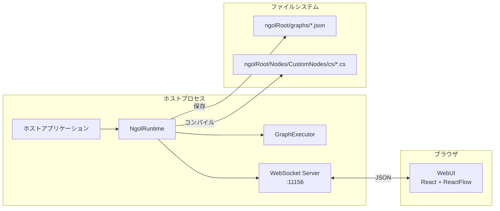
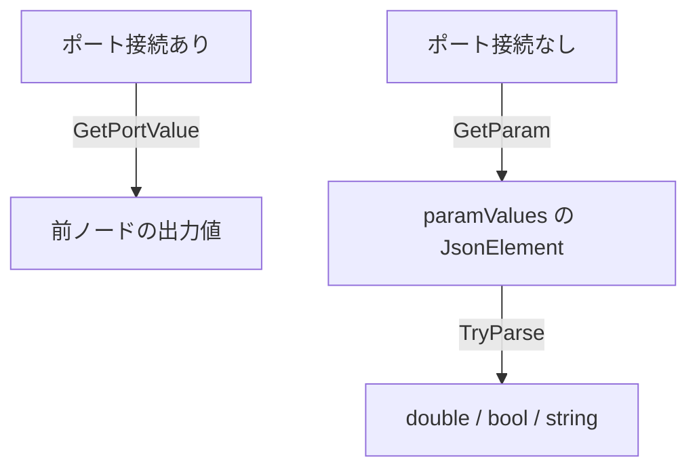
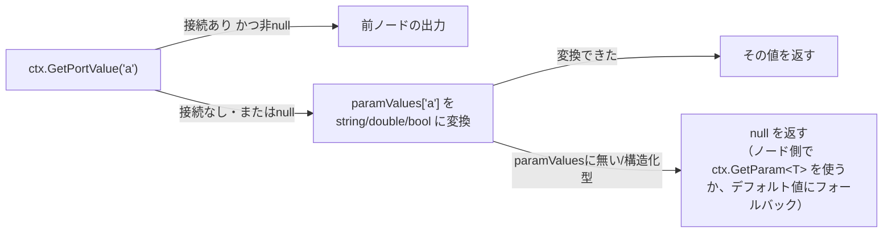
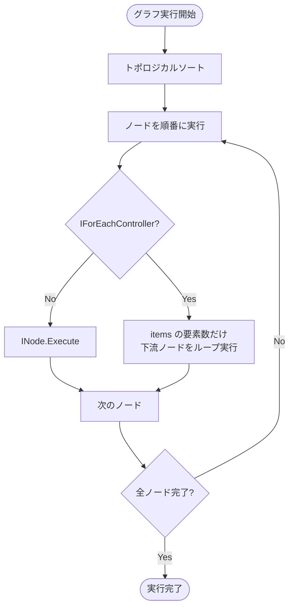
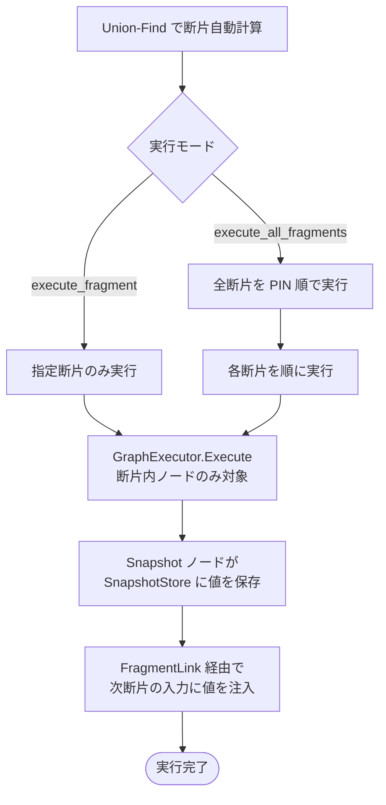

# NodeGraphModLab — Graph Format Specification

> 対象バージョン: NodeGraphModLab v0.7.x
>
> 本ドキュメントは人間向けの完全版です。AI エージェント（MCP 経由）は
> MCP ツール `get_graph_spec` で圧縮版のリファレンスを取得できます。

---

## 目次

1. [概要](#1-概要)
2. [グラフ JSON フォーマット](#2-グラフ-json-フォーマット)
3. [データ型一覧](#3-データ型一覧)
4. [ノードアーキテクチャ](#4-ノードアーキテクチャ)
5. [値の解決ルール (paramValues vs ポート接続)](#5-値の解決ルール)
6. [グラフ保存先とロード](#6-グラフ保存先とロード)
7. [カスタムノード (Nodes/CustomNodes/cs/)](#7-カスタムノード-nodescustomnodescs)
8. [実行モデル](#8-実行モデル)

---

## 1. 概要

NodeGraphModLab (NGOL) は .NET ホストアプリケーションに組み込んで動作するノードグラフ実行環境です。  
WebUI でグラフを編集し、JSON ファイルとして保存・読み込みをし、ホストプロセス内のランタイムが実行します。



---

## 2. グラフ JSON フォーマット

グラフは **UTF-8 JSON** で保存されます。  
保存先: `ngolRoot/graphs/<id>.json`

### 2.1 トップレベル構造

```json
{
  "id":            "string (UUID)",
  "name":          "string",
  "description":   "string",
  "schemaVersion": "0.2.0",
  "version":       1,
  "createdAt":     "2026-04-30T00:00:00+00:00",
  "nodes":         [ ...NodeInstance ],
  "connections":   [ ...NodeConnection ],
  "fragmentLinks": [ ...FragmentLink ],
  "groups":        [ ...NodeGroup ],
  "annotations":   [ ...NodeAnnotation ]
}
```

| フィールド      | 型       | 説明 |
|----------------|----------|------|
| `id`           | string   | グラフの一意ID。ファイル名に使用される |
| `name`         | string   | WebUI 上の表示名 |
| `description`  | string   | 任意の説明文 |
| `schemaVersion`| string   | スキーマバージョン（現在 `"0.2.0"`）。省略時は旧グラフ扱い |
| `version`      | int      | グラフデータバージョン（現在は `1`） |
| `createdAt`    | ISO 8601 | 作成日時 |
| `nodes`        | array    | ノードインスタンス配列 |
| `connections`  | array    | 通常ポート接続配列（同一断片内） |
| `fragmentLinks`| array    | 断片間リンク配列（Snapshot OUT → 別断片 IN） |
| `groups`       | array    | ノードグループ配列（省略可） |
| `annotations`  | array    | 注釈（付箋）ノード配列（省略可） |

### 2.2 NodeInstance

```json
{
  "instanceId":  "string (UUID)",
  "nodeTypeId":  "ngol.logic.add",
  "position":    { "x": 100.0, "y": 200.0 },
  "paramValues": {
    "a": 10,
    "b": 20
  },
  "size": { "width": 220.0, "height": 140.0 }
}
```

| フィールド    | 型                        | 説明 |
|--------------|---------------------------|------|
| `instanceId` | string (UUID)             | グラフ内の一意ID |
| `nodeTypeId` | string                    | ノードタイプID（`[NodeType]` 属性で定義） |
| `position`   | `{x: float, y: float}`    | WebUI 上の表示座標 |
| `paramValues`| `Record<string, JsonElement>` | ポート名 → 固定値 |
| `size`       | `{width: float, height: float}` （省略可） | ユーザーが角ドラッグで手動リサイズしたサイズ。省略時は内容に応じた自動サイズ |

`position` は必ず設定すること（省略すると全ノードが座標 0 で重なる）。ノード間は 250〜300px 離すこと。

⚠️ 実際の描画幅は不明（`size` 省略時は内容に応じた自動サイズ）だからといって、300px より広く間隔を空けないこと。250〜300px は「重ならない」ためではなく「見やすい」ための目安であり、既にノード本体の想定幅を含んだ値。不安だからと400px以上空けると、大半のノード（幅200px前後）ではエッジだけが間延びした見づらいグラフになる。コード表示パネルのように内容量で幅が伸びるノードが混ざる場合のみ、上限寄り（300px）を使う。

### 2.3 NodeConnection

同一断片内のポート接続を表します。

```json
{
  "fromNodeInstanceId": "uuid-A",
  "fromPortName":       "result",
  "toNodeInstanceId":   "uuid-B",
  "toPortName":         "value"
}
```

| フィールド              | 型     | 説明 |
|------------------------|--------|------|
| `fromNodeInstanceId`   | string | 出力元ノードのインスタンスID |
| `fromPortName`         | string | 出力ポート名 |
| `toNodeInstanceId`     | string | 入力先ノードのインスタンスID |
| `toPortName`           | string | 入力ポート名 |

#### 予約ポート名（実行順序専用・データなし）

`fromPortName` / `toPortName` には、以下の予約名が入ることがあります。**全ノードが `[NodePort]` の宣言に関わらず常時持つ**合成ポートです。

| 予約名 | 用途 |
|---|---|
| `__exec_in__` | 入力ポートを1つも持たないノードに WebUI が描画する合成入力ハンドルの id。データは運ばれず、接続によってトポロジカルソート上の実行順序（依存関係）のみを表す |
| `__exec_out__` | 出力ポートを1つも持たないノードに WebUI が描画する合成出力ハンドルの id。同上 |

エンジン（`GraphExecutor` / `GraphTopologyHelper`）はポート名の実在性を検証せず、接続を文字列としてそのまま扱うため、ノード実装側でこれらの名前を実ポートとして宣言しない限り追加対応は不要です。

#### Snapshot ノードの下流接続には NodeConnection を使わない

Snapshot ノード（`ngol.snapshot.*` および `ctx.SnapshotStore?.SetSnapshot(...)` を呼ぶカスタムノード。List Item Selector 等の WebUI 対話選択ノードを含む）の出力を下流ノードへ渡す場合は、`connections`（NodeConnection）ではなく次項の `FragmentLink` を使うこと。`connections` で繋ぐと下流ノードが Snapshot ノードと同一断片（連結成分）に取り込まれ、下流だけを再実行したくても上流の Snapshot ノードごと毎回まとめて再実行されてしまう。特に WebUI のドロップダウン等で選択値を都度変える対話的ノード（`setSnapshotValue` で SnapshotStore を直接更新するパターン、§後述の対話パターン参照）では、下流を独立した断片にして `execute_fragment` で下流だけ再実行できるようにするのが正しい設計。

### 2.4 FragmentLink

断片間の Snapshot 経由接続を表します。`sourceSnapshotNodeInstanceId` は必ず Snapshot ノードです。

```json
{
  "sourceSnapshotNodeInstanceId": "uuid-snapshot",
  "sourcePortName":               "gameobject",
  "toNodeInstanceId":             "uuid-target",
  "toPortName":                   "gameobject"
}
```

| フィールド                        | 型     | 説明 |
|----------------------------------|--------|------|
| `sourceSnapshotNodeInstanceId`   | string | 上流 Snapshot ノードのインスタンスID |
| `sourcePortName`                 | string | Snapshot の出力ポート名（型名） |
| `toNodeInstanceId`               | string | 下流断片の入力先ノードのインスタンスID |
| `toPortName`                     | string | 入力ポート名 |

WebUI では橙色破線の `FRAGMENT LINK` エッジとして表示されます。通常の `connections` には含まれず、断片の連結成分計算からも除外されます。Snapshot ノードの出力を下流に渡す接続は原則こちらを使う（前項 2.3 参照）。

### 2.5 NodeGroup

ノードをグループ化する際の情報を表します（折りたたみ・展開可能）。

```json
{
  "id":              "group-uuid",
  "name":            "My Group",
  "description":     "任意の説明文（省略可）",
  "nodeInstanceIds": ["node-uuid-1", "node-uuid-2"],
  "collapsed":       false
}
```

| フィールド         | 型       | 説明 |
|-------------------|----------|------|
| `id`              | string   | グループの一意ID |
| `name`            | string   | グループ名（WebUI 表示） |
| `description`     | string?  | グループの用途・出力内容を記述する説明文（省略可） |
| `nodeInstanceIds` | string[] | グループに属するノードのインスタンスID一覧 |
| `collapsed`       | bool     | 折りたたみ状態 |

### 2.6 NodeAnnotation

キャンバス上の付箋メモを表します。

```json
{
  "id":       "annot-uuid",
  "text":     "ここにメモを書く",
  "position": { "x": 100.0, "y": 200.0 },
  "width":    200,
  "height":   100,
  "color":    "#fffde7"
}
```

| フィールド  | 型                     | 説明 |
|------------|------------------------|------|
| `id`       | string                 | 注釈の一意ID |
| `text`     | string                 | 表示するテキスト |
| `position` | `{x: float, y: float}` | キャンバス上の座標 |
| `width`    | number                 | 幅（ピクセル、省略時 200） |
| `height`   | number                 | 高さ（ピクセル、省略時 100） |
| `color`    | string                 | 背景色（CSS カラー文字列、省略可） |

### 2.7 完全なサンプル

```json
{
  "id": "sample-add-log",
  "name": "加算してログ出力",
  "description": "2つの数値を加算してログに出力するシンプルな例",
  "schemaVersion": "0.2.0",
  "version": 1,
  "createdAt": "2026-04-30T00:00:00+00:00",
  "nodes": [
    {
      "instanceId": "node-const-a",
      "nodeTypeId": "ngol.logic.const_number",
      "position": { "x": 0, "y": 0 },
      "paramValues": { "value": 10 }
    },
    {
      "instanceId": "node-const-b",
      "nodeTypeId": "ngol.logic.const_number",
      "position": { "x": 0, "y": 80 },
      "paramValues": { "value": 20 }
    },
    {
      "instanceId": "node-add",
      "nodeTypeId": "ngol.logic.add",
      "position": { "x": 250, "y": 40 },
      "paramValues": {}
    },
    {
      "instanceId": "node-log",
      "nodeTypeId": "ngol.logic.log",
      "position": { "x": 480, "y": 40 },
      "paramValues": { "label": "合計" }
    }
  ],
  "connections": [
    { "fromNodeInstanceId": "node-const-a", "fromPortName": "value",  "toNodeInstanceId": "node-add", "toPortName": "a" },
    { "fromNodeInstanceId": "node-const-b", "fromPortName": "value",  "toNodeInstanceId": "node-add", "toPortName": "b" },
    { "fromNodeInstanceId": "node-add",     "fromPortName": "result", "toNodeInstanceId": "node-log", "toPortName": "value" }
  ]
}
```

---

## 3. データ型一覧

ポートの `dataType` は文字列で指定します。

| 型名         | C# 実際の型                  | 説明 |
|-------------|------------------------------|------|
| `number`    | `double`                     | 汎用数値型 |
| `float`     | `double`                     | `number` と等価（別名） |
| `int`       | `double`                     | 整数扱いだが内部は double |
| `string`    | `string`                     | テキスト |
| `boolean`   | `bool`                       | true / false。`"bool"` も同義の別名として通る |
| `any`       | `object?`                    | 任意の値 |
| `any[]`     | `IReadOnlyList<object?>`     | 任意型のリスト |
| `GameObject`| `object` (Unity IL2CPP)      | UnityEngine.GameObject（リフレクション経由） |
| `GameObject[]`| `List<object?>`            | GameObject のリスト |
| `Color`     | `object` (UnityEngine.Color) | `{r, g, b, a}` オブジェクト |
| `Vector3`   | `object` (UnityEngine.Vector3) | `{x, y, z}` — MakeVector3 出力 |

> **注意:** Unity IL2CPP 環境では `UnityEngine.XXX` 型を直接参照できないため、  
> プラグイン内ではリフレクションを使用して操作します。

### paramValues の型マッピング

JSON の `paramValues` は `JsonElement` として格納されます。  
ノードの Execute メソッド内では以下のように解決されます：



---

## 4. ノードアーキテクチャ

### 4.1 ノードタイプ定義

C# クラスに `[NodeType]` と `[NodePort]` 属性を付けることでノードを定義します：

```csharp
[NodeType(
    "ngol.logic.add",   // ノードタイプID (グローバル一意)
    "Logic/Math",       // カテゴリ (スラッシュ区切りで階層)
    "Add Numbers",      // 表示名
    Description = "Add two numeric values."
)]
[NodePort("a",      PortDirection.Input,  "number", IsRequired = true)]
[NodePort("b",      PortDirection.Input,  "number", IsRequired = true)]
[NodePort("result", PortDirection.Output, "number")]
public sealed class AddNode : INode
{
    public void Execute(IExecutionContext ctx) { ... }
}
```

### 4.2 ノードタイプID 命名規則

```
{namespace}.{category}.{name}
```

| セグメント  | 説明 | 例 |
|------------|------|----|
| `ngol`     | 組み込みノード (NodeGraphModLab) | `ngol.*` |
| カテゴリ   | `logic`, `unity` など | `ngol.logic.*` |
| 名前       | スネークケース | `ngol.logic.add` |

カスタムノード（Nodes/CustomNodes/cs/）も同じ規則を推奨します。

---

## 5. 値の解決ルール

ノードがポートの値を取得するとき、以下の優先順位で解決されます：

1. **ポート接続** — 前ノードの `SetPortValue` で設定された値
2. **paramValues** — JSON の `paramValues` オブジェクト（WebUI のインスペクター欄・ノード本体のインライン欄で設定）
3. **デフォルト値** — ノード実装のフォールバック（`?? defaultValue`）

**`ctx.GetPortValue(name)` は上記の 1→2 を自動的にフォールバックします**。接続がある場合はその値を、接続が無い（または接続先が `null` を出力した）場合は `paramValues` の値を `string` / `double` / `bool` のいずれかに変換して返します。ノード実装は原則として単に `ctx.GetPortValue(name)` を呼ぶだけでよく、`?? ctx.GetParam<T>(name)` を自前で書く必要はありません。

`ctx.GetParam<T>(name)` は `paramValues` のみを対象に、**`object` / `array`（`Color` / `Vector3` など構造化型）を含む任意の型 `T` へ JSON デシリアライズしたい場合**に使います（`GetPortValue` は string/double/bool のプリミティブ型しか変換できないため）。



### Color 型の paramValues 形式

Color型ポートは `{r, g, b, a}` の JSON オブジェクトとして保存されます：

```json
"paramValues": {
  "color": { "r": 1.0, "g": 0.5, "b": 0.0, "a": 1.0 }
}
```

---

## 6. グラフ保存先とロード

```
ngolRoot/
├── graphs/                   ← グラフJSONファイル
│   ├── <graph-id>.json
│   └── all-nodes-test.json
├── Nodes/
│   ├── Builtin/
│   │   └── NodeGraphModLab.BuiltinNodes.dll  ← 組み込みノード定義
│   └── CustomNodes/cs/       ← Roslyn動的コンパイルノード（ホットリロード対応）
│       ├── MyCustomNode.cs
│       └── ai_generated/     ← AI生成解析ノード
├── WebUI/
│   └── plugins/              ← WebUI 外部 UI プラグイン（.js、要 F5 リロード）
├── mcp/
│   └── docs/                 ← MCP get_* ツールが参照する AI 向けリファレンス
└── NodeGraphModLab.Core.dll           ← コアロジック
```

- グラフファイル名は `{id}.json` または任意のファイル名
- ランタイム起動時に `graphs/` フォルダを自動スキャン
- WebUI からも一覧取得・保存・読み込みが可能

---

## 7. カスタムノード (Nodes/CustomNodes/cs/)

`Nodes/CustomNodes/cs/` フォルダに `.cs` ファイルを配置すると、  
ホストアプリケーション起動時および実行中（ホットリロード・500ms debounce）に **Roslyn** でコンパイルしてノードとして登録されます。  
サブディレクトリ（例: `ai_generated/`）も対象です。

### テンプレート

```csharp
// Nodes/CustomNodes/cs/MyCustomNode.cs
using NodeGraphModLab.NodeAPI;

[NodeType("custom.my_node", "Custom", "My Node",
    Description = "カスタムノードの説明")]
[NodePort("input_value", PortDirection.Input, "number")]
[NodePort("output_value", PortDirection.Output, "number")]
public sealed class MyCustomNode : INode
{
    public void Execute(IExecutionContext ctx)
    {
        var input = ctx.GetPortValue("input_value") as double? ?? 0.0;
        ctx.SetPortValue("output_value", input * 2.0);
    }
}
```

### Unity API へのアクセス

IL2CPP 環境では Unity 型を直接参照できないため、リフレクションを使用します：

```csharp
// UnityEngine.GameObject.Find("ObjectName")
var goType = System.Type.GetType("UnityEngine.GameObject, UnityEngine.CoreModule");
var findMethod = goType?.GetMethod("Find", new[] { typeof(string) });
var go = findMethod?.Invoke(null, new object[] { "ObjectName" });
```

メインスレッド操作が必要な場合は `MainThreadDispatch` を使用します：

```csharp
var done = new System.Threading.ManualResetEventSlim(false);
ctx.MainThreadDispatch(() =>
{
    // ここでUnity API を呼ぶ
    done.Set();
});
done.Wait(System.TimeSpan.FromSeconds(2));
```

---

## 8. 実行モデル

### 通常実行（断片数 ≤ 1）



### 断片実行（断片数 ≥ 2）

断片は通常コネクタの連結成分から自動的に計算されます（Union-Find アルゴリズム）。



**断片 ID**: `auto-{連結成分内の最小 nodeInstanceId}` で安定生成されます。

### スレッドモデル

- **グラフ実行スレッド**: バックグラウンドのワーカースレッド（ホストのメインスレッドとは別）
- **ホスト固有 API 呼び出し**: `ctx.MainThreadDispatch(Action)` でメインスレッドにキュー
- **タイムアウト**: 各 `done.Wait(TimeSpan.FromSeconds(2))` で最大 2 秒待機

### ForEach ループ

`ngol.logic.foreach` ノードは `IForEachController` を実装し、  
下流ノードを items の数だけ繰り返し実行します。

```
items: [A, B, C]
  → current_item=A, index=0 → 下流ノード実行
  → current_item=B, index=1 → 下流ノード実行
  → current_item=C, index=2 → 下流ノード実行
```
